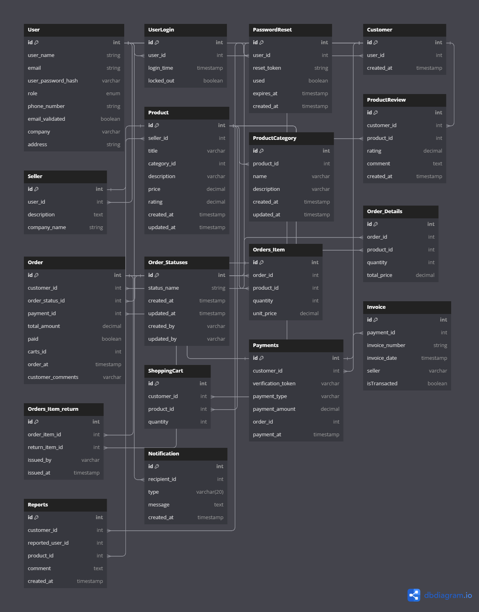

# FullCommerceProject
스프링 부트 : 데이터 기반 커머스 플랫폼

## 🖥️ 프로젝트 소개
기존의 커머스 데이터 분석은 고객의 구매 패턴과 접근성에 대한 문제점을 파악하는 데 한계가 있다. 복잡한 기능과 프로세스를 개선하고 고객 경험을 개선할 수 있다.

 

## 🕰️ 개발 기간
- 1차 : 2023.10.16 - 2023.11.19 
  -. 1주차: 회원가입 및 로그인 
  -. 2주차: 공통 기능 
  -. 3주차: 판매자, 구매자 기능 
  -. 4주차: 관리자 기능 
  
- 2차 : 2023.11.19 - TBD

 

## 프로젝트 목적
데이터 기반으로 구매 고객과 판매자 간의 새로운 방식의 연결망을 통해 구매 고객과 판매자의 시간적, 경제적으로 효율성을 확보하여 사람들의 삶의 질을 향상시킬 수 있는 서비스 기획

 

## 기획배경
현대 사회에서 많은 사람들이 바쁜 시간 속에서 살아가고 있음에 따라 보상심리로 인해 많은 시간을 들여 과도한 소비, 잘못된 소비하는 것도 쉽지 않은 문제가 되고 있다. 이러한 문제점을 해결하기 위해, 구매자에게 상품 검색 기능 및 결제 프로세스를 보다 간편하게 만들어 경제적이고 효율적인 구매를 할 수 있고, 판매자는 데이터를 통해 마케팅 효과를 확보하여 더 효율적인 시스템을 가질 수 있도록 기획하였다.

 

## 목적 및 기대 효과
- 구매자 : 적은 시간과 노력으로 경제적인 소비 습관 확보
    (AI 기반 상품 추천 기능, 간편 결제 기능, 실시간 배송 추적 기능)
- 판매자 : 판매 데이터 시스템 확보
    (AI 기반 고객 행동 분석, 고객 세그먼테이션 분석, 마케팅 효과 분석)
- 좋은 접근성과 다양한 계층의 소비를 통해 효율적인 경제 활동 및 소비 문화 형성

 

## ⚙️ 개발 환경

| 분류 | 기술 스택 |
| --- | --- |
| **언어** | Java |
|          | Spring Boot |
| **프레임워크** | Spring Boot |
|               | Spring MVC |
|               | Spring Data JPA |
|               | Spring Boot Admin |
| **데이터베이스** | MySQL |
| **개발 도구** | IntelliJ IDEA |
|              | Maven |
|              | git |
|              | JUnit5 |
|              | Chrome |
| **기타 도구** | Lombok |
|              | MyBatis |
|              | Boot pay |
|              | Cool SMS api |
| **인증/인가** | Naver OAuth |
|             | Kakao OAuth |

 

## 프로젝트 기능 및 설계

### 회원가입 및 로그인
#### 회원가입
- 사용자가 회원가입 시에는 이메일, 아이디, 비밀번호, 핸드폰 번호 정보 필수 입력
- 이메일 주소는 유효성 검사를 거쳐 올바른 형식인지 확인. 이메일 주소 형식은 RFC 5322와 같은 규격 준수
- 비밀번호는 보안을 강화하기 위해 최소 길이(예: 8자 이상), 비밀번호 정책에 따른 검증 필요
- 이메일 인증은 가입 신청 후 이메일 주소로 인증 링크를 전송하여, 인증 링크 클릭 시 가입 완료. 이때, 인증 링크에는 고유한 토큰이 포함되어야 하며, 사용자가 클릭했을 때 이 토큰을 확인하여 가입 승인
- 이미 가입된 이메일 또는 아이디로 가입 시도 시, 사용자에게 오류 메시지를 반환하여 중복 가입 방지

#### 로그인
- 사용자가 로그인할 때는 입력된 아이디와 비밀번호를 검증하여 일치해야 함
  - 해싱: 사용자 비밀번호를 안전한 해싱 알고리즘 (예: BCrypt)을 사용하여 저장
- 로그인 성공 시 JWT(Json Web Token)를 발급하여 유저를 식별하고 권한 부여. JWT에는 사용자 정보 및 권한 담아야 함
- JWT 토큰의 만료 시간을 설정하여 보안을 강화. 일반적으로 15분에서 1시간 정도의 짧은 기간을 설정하며, 토큰이 만료되면 다시 로그인해야 함

#### 아이디/비밀번호 찾기
- 아이디 찾기
  - 사용자가 가입 시 입력한 이메일 주소로 해당 이메일과 연관된 아이디를 이메일로 제공. 이때, 이메일에는 아이디가 뒤에서부터 3~4칸 정도 마스킹되어야 함

- 비밀번호 찾기
  - 사용자가 가입한 이메일과 아이디를 입력하면, 이메일을 통해 안전한 방법으로 임시 비밀번호 전송
    - 안전한 무작위 비밀번호 생성: 크립토그래피적으로 안전한 무작위 비밀번호 생성. 이후 사용자는 이 임시 비밀번호로 로그인한 뒤 비밀번호 재설정
    - 임시 비밀번호는 한 번 사용하면 더 이상 사용할 수 없도록 만료되어야 함
    - 임시 비밀번호가 안전하게 저장되어야 하며, 전송할 때 암호화된 형태로 보내져야 함

### 공통 기능
#### 상품 검색
- 사용자는 검색 옵션 (카테고리, 가격순, 판매량순, 최신순, 별점순, 이름)을 선택하여 검색 가능

#### 개인정보 수정
- 사용자는 핸드폰 번호와 비밀번호 수정 가능
- 비밀번호를 변경할 때, 현재 비밀번호를 확인하고 새로운 비밀번호를 입력하여 변경
- 새로운 비밀번호는 안전한 방법으로 저장

#### 문의하기
- 1:1 문의 기능으로 관리자에게 질문 및 피드백 전송
- 관리자는 질문과 답변을 데이터베이스에 저장하여 추적 가능

#### 신고하기
- 판매자와 고객 모두 상품에 달린 댓글 신고 가능
- 신고 내용을 관리자에게 자동 전달하고 적절한 조치를 판단할 수 있도록 설정

#### 고객 알림
- 판매자는 팔린 상품에 대한 알림을 고객에게 제공
- 상품 리뷰에 대한 알림을 판매자에게 제공
- 판매 중인 상품과 승인 요청 중인 상품의 목록 확인
- 리뷰에 대한 판매자 답글 작성이 가능
- 관리자에게 질문한 문의에 대한 알림을 고객에게 제공
- 신고에 대한 알림을 고객 및 판매자에게 제공

### 판매자 기능
#### 상품 관리
- 상품 등록
  - 카테고리, 가격, 별점, 상세조건, 재고량 및 상품 이미지 URL과 같은 상품 정보 입력
  - 상품 이미지를 안전한 방법으로 업로드에 필요한 파일 업로드 보안 검증 필요
- 상품 및 상세조건 수정 및 삭제
- 상품 등록 시, 승인이 필요한 경우 관리자에게 승인 요청. 승인 여부 확인 후 관리자와의 통신을 위한 알림 기능 필요

### 구매자 기능
#### 상품 관리
- 상품 구매 및 목록 확인
- 상품을 장바구니에 추가 및 삭제
- 상품 구매 및 취소/환불 목록 확인
- 배송지 설정 및 수정
- 상품 리뷰 댓글을 추가, 수정, 삭제하고 목록 확인
- 판매자의 리뷰 답글 확인
- 리뷰 작성 시 평점과 텍스트 입력

### 관리자 기능
#### 사용자 관리
- 사용자 계정 관리, 판매자 및 구매자 계정 확인, 수정, 삭제, 활동 제한 및 해제
- 사용자 정보의 무단 변경 방지를 위한 접근 권한 설정
- 사용자 관리를 위한 사용자 및 권한 관리 시스템 필요

#### 상품 관리
- 플랫폼에 등록된 상품 정보 모니터링
- 상품과 관련된 조치를 판매자와 구매자에게 알림
- 상품의 승인 및 반려 프로세스(구체적으로) 관리 기능 필요

#### 주문 및 거래 관리
- 주문과 거래 추적
- 배송 상태 변경 및 추적

#### 고객 피드백 및 문제 해결
- 고객의 피드백 수집 및 문제 해결 프로세스(구체적으로) 구현
- 사용자의 문의에 대한 답변 제공 및 문제 처리 필요

 

## ERD

## Trouble Shooting
[트러블 슈팅 히스토리](doc/TROUBLE_SHOOTING.md)

 

## 개인 프로젝트에서 느낀점
- 어려웠던 부분
    * 
    * 
- 문제를 해결했던 부분
    * 
    * 
- 협업의 중요성
    * 
- 총평
    * 
    * 
